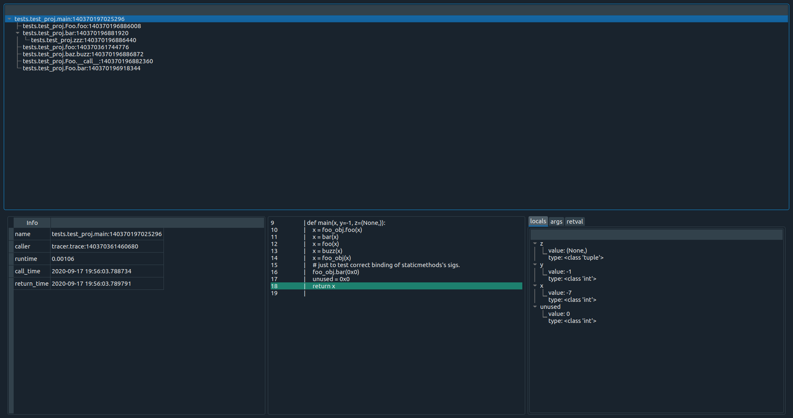

# Description
a GUI tool for timeless tracing of python function / method calls.

# Example
- this is an extremely useful example of tracing.
```
from tracer.gui_qt import Tracer
from tests.test_proj.main import main

tracer = Tracer()
tracer.trace(main, args=(2,))
```
